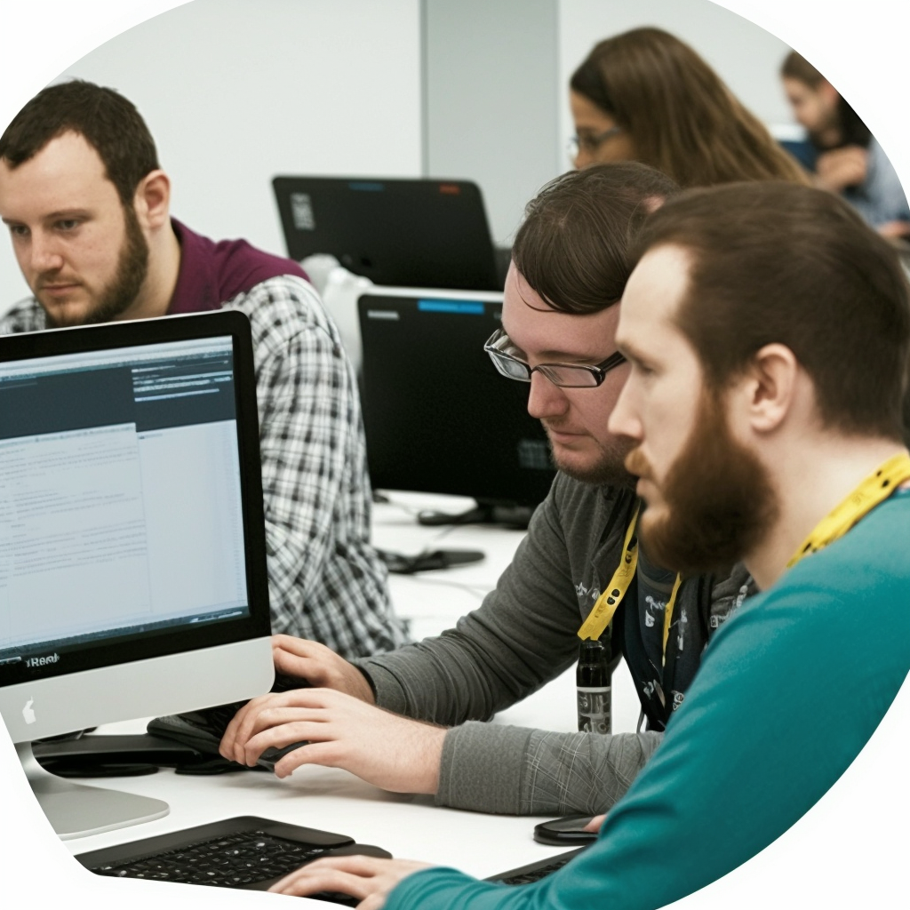

# Introducción a un curso de desarrollo web
 

  

 

 

**I. Presentación**

- Saludo y bienvenida
  > Se les saluda y se les da la mas cordial bienvenida ak curso de Desarrollo Web Front End.
- Presentación de Dra. Angela Yu:
  > Desarrolladora senior y la instructora principal en el London App Brewery.
- Experiencia de la instructora
  > Ha enseñado a más de un millón de estudiantes en todo el mundo, tanto en persona como en línea.

**II. Contenido del curso**

- Duración del curso
  > 65 Horas.
- Contenido multimedia disponible
  > Más de 55 horas de contenido de video HD, tutoriales paso a paso, ejercicios de codificación interactivos, cuestionarios y mucho más.
- Curriculum del curso
  > 41 secciones • 490 clases • 65 h 33 m de duración total
- Enfoque del curso en proyectos prácticos
- Proyectos que se construirán en el curso

**III. Audiencia del curso**

- Curso diseñado para principiantes
- Curso accesible para desarrolladores avanzados

**IV. Comparación con otros cursos**

- Costo de un curso presencial
- Ventajas de tomar un curso en línea
- Testimonios de estudiantes anteriores

**V. Invitación a tomar el curso**

- Resumen de los beneficios del curso
- Invitación a unirse al curso

**Conceptos clave:** desarrollo web, , , , , , 
proyectos prácticos, principiantes, desarrolladores avanzados, cursos en línea, 
testimonios, beneficios del curso.

En este video, se presenta un curso de desarrollo web impartido por una instructora con experiencia en el área. La presentación del curso destaca su enfoque en proyectos prácticos y su accesibilidad tanto para principiantes como para desarrolladores avanzados. Además, se hace una comparación con cursos presenciales para resaltar las ventajas de tomar el curso en línea.

Las partes más importantes del video son:

1. Presentación de la instructora y su experiencia en el área.
1. Contenido del curso, que incluye acceso a multimedia y proyectos prácticos.
1. Audiencia del curso, que es accesible para principiantes y desarrolladores avanzados.
1. Comparación con cursos presenciales y las ventajas de tomar el curso en línea.
1. Invitación a unirse al curso y los beneficios del mismo.

En resumen, el curso de desarrollo web ofrece una experiencia completa para aquellos que quieran aprender a crear sitios web y aplicaciones web, independientemente de su nivel de experiencia. La instructora tiene una amplia experiencia en el área y el curso se enfoca en proyectos prácticos para que los estudiantes puedan aplicar lo que aprenden. Además, la opción de tomar el curso en línea ofrece muchas ventajas en 
términos de costo y flexibilidad.