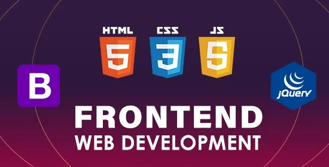

# Front-End Web Development

  

  

   

1. [What You'll Get in This Course](./01_What_You'll_Get_in_This_Course/Readme.md)
  
1. Download the Course Syllabus
    > [Descargar el programa del curso](https://drive.google.com/uc?export=download&id=1uhCUGouBsclvAH8S9d-_Z9B5hKnKdCoR)
  
1. Download the Course Resources
    > A lo largo del curso, se señalará hacia plantillas de proyectos, herramientas increíbles, enlaces, recursos y lecturas de fondo que ayudarán a aprender sobre desarrollo web. Se han recopilado todos juntos agrupados por módulo, para que puedan ser encontrados fácilmente.

    > Haga clic en el botón a continuación para descargar el PDF de recursos del curso, de modo que siempre que necesite un enlace podrá consultar la lista.

    > 

 

1. Download the 12 Rules to Learn to Code eBook
    >
<a target="_blank" rel="noopener noreferrer" href="https://att-c.udemycdn.com/2021-11-02_15-48-58-9cc341f572e648c2df98cc8e419251a8/original.pdf?response-content-disposition=attachment%3B+filename%3D12%2BRules%2Bto%2BLearn%2Bto%2BCode%2B%255B2nd%2BEdition%255D%2B2022.pdf&Expires=1680002044&Signature=HIBSMJr~Mgle4TBH-8eXKi~TU-np1hbVT5P87-OHW~7q~yvTELKasXMQq6Vo2yJ6rVzblT~jwtP7vyCGRs9S3ETsSp3l7ntkvSoVEmgmU6M469W1qhzXkxOPF9gLsJmgE4~6hwXXvhkJDRvfcbequpM-u59PPlvU~wPwxAbHC6IstPA-5eVTF8YeFcXl~uE-YkgO9xOC0Tif3HTkW-J~VJ3Uk2HyN~12Drs8WVvIH~xApEMSug1WAac2~RvHoCplFoZYcvXqW5DOCPHNNb3D1m4l9kZxNCU~7Llq-BBZCyOs-UMTcO-~RoqXd0-xqvXXlSMwwh-q7NcelquOlr1SMA__&Key-Pair-Id=APKAITJV77WS5ZT7262A"></a>

 

1. Download the Required Software
    1. Install Visual Studio Code
         - This is a free piece of software from Microsoft that you will use to write your code.

            https://code.visualstudio.com/

    2. Install Google Chrome
        - This is a free browser from Google that we need for development. Even if you normally use another browser, I recommend downloading Chrome for their developer tool suite which we will use extensively in the course.
        
            https://www.google.com/intl/en_uk/chrome/
            
  

1. How Does the Internet Actually Work?

1. How Do Websites Actually Work?

1. How to Get the Most Out of the Course

1. How to Get Help When You're Stuck

1. Pathfinder