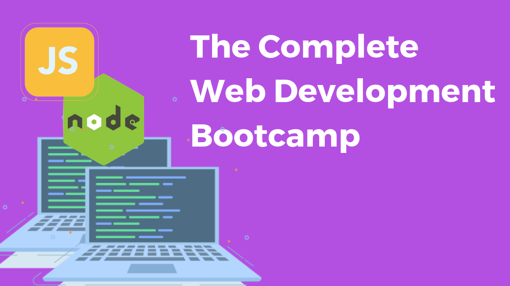

<h1 align="center">👨‍💻 The Complete Web Development Course</h1> 

<table>
  <tr>
    <td align="center">
      
    </td>
    <td align="center">
      
    </td>
    <td align="center">
      
    </td>
    <td align="center">
      
    </td>
  </tr>
  <tr>
    <td align="center">
      
    </td>
    <td align="center">
      
    </td>
    <td align="center">
      
    </td>
    <td align="center">
      
    </td>
  </tr>
</table>

  

  

  

The complete full-stack web development bootcamp with HTML 5, CSS 3, Javascript ES6, Bootstrap 4, JQuery, Node.js, MongoDB and more!
  
## 
Technologies 

  

    
    
    
    
    
    
    
    
  

  

# Web Development Course Content

### 🚀 Front-End Web Development
### 🚀 Introduction to HTML
### 🚀 Intermediate HTML
### 🚀 Introduction to CSS
### 🚀 Intermediate CSS
### 🚀 Introduction to Bootstrap 4
### 🚀 Intermediate Bootstrap
### 🚀 Web Design School - Create a Website that People Love
### 🚀 Introduction to Javascript ES62
### 🚀 Intermediate Javascript
### 🚀 The Document Object Model (DOM)
### 🚀 Boss Level Challenge 1 - The Dicee Game
### 🚀 Advanced Javascript and DOM Manipulation
### 🚀 jQuery
### 🚀 Boss Level Challenge 2 - The Simon Game
### 🚀 The Unix Command Line
### 🚀 Backend Web Development
### 🚀 Node.js
### 🚀 Express.js with Node.js
### 🚀 APIs - Application Programming Interfaces
### 🚀 Git, Github and Version Control
### 🚀 EJS
### 🚀 Boss Level Challenge 3 - Blog Website
### 🚀 Databases
### 🚀 SQL
### 🚀 MongoDB
### 🚀 Mongoose
### 🚀 Putting Everything Together
### 🚀 Deploying Your Web Application
### 🚀 Boss Level Challenge 4 - Blog Website Upgrade
### Build Your Own RESTful API From Scratch
### Authentication & Security
### React.js
### Web3 Decentralised App (DApp) Development with the Internet Computer
### Build Your First Defi (Decentralised Finance) DApp – DBANK
### Deploying to the ICP Live Blockchain
### Building DApps on ICP with a React Frontend
### Create Your Own Crypto Token
### Minting NFTs and Building an NFT Marketplace like OpenSea
### Optional Module: Ask Angela Anything
### Next Steps